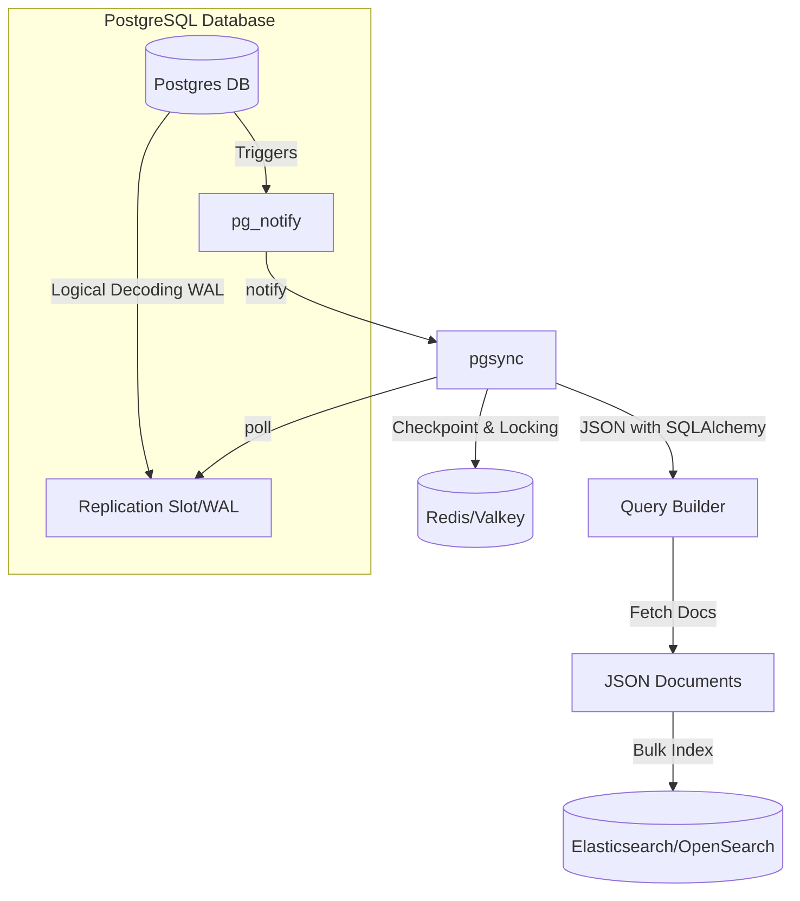

# PGSync Architecture

## Overview

**PGSync** is a middleware designed to synchronize data from PostgreSQL to Elasticsearch/OpenSearch. It allows you to maintain PostgreSQL as the primary source of truth while exposing structured, denormalized documents in Elasticsearch/OpenSearch.

By leveraging PostgreSQL's logical decoding feature, PGSync captures real-time changes and reflects them in the search engine, facilitating efficient and scalable search capabilities.

GitHub repo: [https://github.com/toluaina/pgsync](https://github.com/toluaina/pgsync)

---

Architecture

---

## Core Components

- **PostgreSQL**: The primary relational database. PGSync uses PostgreSQL's logical decoding to capture changes.
- **Redis**/**Valkey**: A message broker used to manage sync state and queues.
- **Elasticsearch/OpenSearch**: The destination search engine where documents are indexed.
- **PGSync Daemon**: The core service that reads changes from PostgreSQL and indexes them into the search engine.

---

## Data Flow

1. **Schema Definition**
Users define a JSON schema (`schema.json`) to map PostgreSQL tables to Elasticsearch/OpenSearch documents.

2. **Bootstrap**
PGSync sets up replication slots and triggers needed for change capture.

3. **Change Capture**
PGSync listens for data changes via logical decoding (insert, update, delete).

4. **Transformation**
Data changes are transformed into structured documents per the schema.

5. **Indexing**
Documents are indexed into Elasticsearch/OpenSearch in near real-time.

---

## Project Structure

<pre>
<code>
pgsync/
├── bin/ # executable startup scripts
├── demo/ # demo data and configurations
├── docker/ # docker configurations and entrypoints
├── docs/ # documentation assets
├── examples/ # example schema.json files
├── pgsync/ # core application source code
│ ├── settings.py # configuration loading
│ ├── redisqueue.py # Redis/Valkey consumer logic
│ ├── base.py # PostgreSQL connection and queries
│ ├── search_client.py # Elasticsearch/OpenSearch indexing logic
│ ├── sync.py # entry point for PGSync
│ ├── node.py # schema parsing and validation
│ └── utils.py # utility functions
├── plugins/ # extension points for custom behavior
├── requirements/ # dependency lists for pip
├── scripts/ # dev and ops scripts
├── tests/ # unit and integration test cases
├── .env.sample # sample environment variables file
├── Dockerfile # docker image definition
├── docker-compose.yml # docker compose configuration
├── README.md # main project README
└── setup.py # Python package configuration
</code>
</pre>

## Key Features

- **Real-Time Sync**: Reflects PostgreSQL changes into Elasticsearch/OpenSearch with minimal delay.
- **Schema-Based**: JSON schema defines mappings and transformations.
- **Nested Relationships**: Handles complex joins and denormalization.
- **Fault Tolerance**: Designed to resume and recover gracefully.
- **Lightweight Impact**: Minimal load on source database.

---

## Deployment Notes

- **Docker-Ready**: Use included Docker setup for fast deployment.
- **Environment-Based Configuration**: Configurable using `.env` or shell variables.
- **Scalable**: Suited for high-volume transactional data environments.

---

## Future Enhancements

- Zero-downtime schema migrations
- Improved observability (logging, metrics)
- Enhanced plugin support for new targets

---

For detailed usage instructions, see the [README](https://github.com/toluaina/pgsync) or [project documentation](https://toluaina.github.io/).