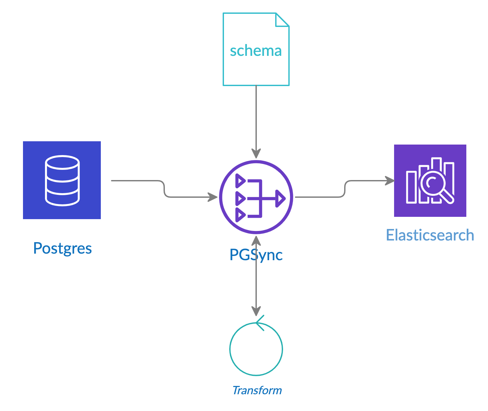

# PGSync

## PostgreSQL to Elasticsearch sync

PGSync is a middleware for shipping data from [Postgres](https://www.postgresql.org) to [Elasticsearch](https://www.elastic.co/products/elastic-stack).  
It allows you to keep [Postgres](https://www.postgresql.org) as your source of truth data source and
expose structured denormalized documents in [Elasticsearch](https://www.elastic.co/products/elastic-stack).

Changes to nested entities are propagated to [Elasticsearch](https://www.elastic.co/products/elastic-stack).
PGSync's advanced query builder generates optimized SQL queries 
on the fly based on your schema.
PGsync's advisory model allows you to quickly move and transform large volumes of data quickly whilst maintaining relational integrity.

Simply describe your document structure or schema in JSON and PGSync will 
continuously capture changes in your data and load it into [Elasticsearch](https://www.elastic.co/products/elastic-stack) 
without writing any code. 
PGSync transforms relational data into a structured document format.

It allows you to take advantage of the expressive power and scalability of 
[Elasticsearch](https://www.elastic.co/products/elastic-stack) directly from [Postgres](https://www.postgresql.org). 
You don't have to write complex queries and transformation pipelines.
PGSync is lightweight, fast and flexible.

When we denormalize from relational to document, we loose meaning required to reconstruct any changes.
Moreover, you shouldn't store your primary data in [Elasticsearch](https://www.elastic.co/products/elastic-stack).
So how do you then get your data into [Elasticsearch](https://www.elastic.co/products/elastic-stack) in the first place? 
Tools like Logstash and Kafka can aid this task but they still require a bit 
of engineering and development.

[ETL](https://en.wikipedia.org/wiki/Extract,_transform,_load) and [CDC](https://en.wikipedia.org/wiki/Change_data_capture) tools can be complex and expensive.

Other benefits of PGSync include:
- Real-time analytics
- Reliable primary datastore/source of truth
- Scale on-demand

SCHEMA DIAGRAM

Inline-style: 

- [TODO: add showterm.io demo here]

#### Why?

At a high level, you have data in a Postgres database and you want to mirror it in Elasticsearch.  
This means every change to your data (*Insert*, *Update*, *Delete* and *Truncate* statements) needs to be replicated to Elasticsearch. 
At first, this seems easy and then it's not. Simply add some code to copy the data to Elasticsearch after updating the database (or dual writes).
Writing SQL queries spanning multiple tables and involving multiple relationships are hard to write.
Detecting changes within a nested document can also be quite hard.
Of course, if your data never changed, then you could just take a snapshot in time and load it into Elasticsearch as a one-off operation.

PGSync is appropriate if:
- [Postgres](https://www.postgresql.org) is your read/write source of truth whilst [Elasticsearch](https://www.elastic.co/products/elastic-stack) is your 
read-only search layer.
- Your data is constantly changing.
- You have existing data in a relational database such as [Postgres](https://www.postgresql.org) and you need
a secondary NoSQL database like [Elasticsearch](https://www.elastic.co/products/elastic-stack) for text-based queries or autocomplete queries to mirror the existing data without having your application perform dual writes.
- You want to keep your existing data untouched whilst taking advantage of
the search capabilities of [Elasticsearch](https://www.elastic.co/products/elastic-stack) by exposing a view of your data without compromising the security of your relational data.
- Or you simply want to expose a view of your relational data for search purposes.


#### How it works

PGSync is written in Python (supporting version 3.4 onwards) and the stack is composed of: [Redis](https://redis.io), [Elasticsearch](https://www.elastic.co/products/elastic-stack), [Postgres](https://www.postgresql.org), and [SQlAlchemy](https://www.sqlalchemy.org).

PGSync leverages the [logical decoding](https://www.postgresql.org/docs/current/logicaldecoding.html) feature of [Postgres](https://www.postgresql.org) (introduced in PostgreSQL 9.4) to capture a continuous stream of change events.
This feature needs to be enabled in your [Postgres](https://www.postgresql.org) configuration file by setting:
```
> wal_level = logical
```

You can select any pivot table to be the root of your document.

PGSync's query builder builds advanced queries dynamically against your schema.

PGSync operates both pull and event-driven model.
It creates a trigger for tables in your database to handle events.

*This is the only time PGSync will ever make any changes to your database.*

NOTE: **if you change your database schema, or PGSync's schema config, you would need to drop and rebuild your indexes.**
There are plans to support zero-downtime migrations to streamline this process.


#### Quickstart

There are several ways of installing and trying PGSync
 - [Running in Docker](#running-in-docker) is the easiest way to get up and running.
 - [Manual configuration](#manual-configuration) 

##### Running in Docker

To startup all services with docker.
Run:
```
docker-compose up
```

In another shell run 
```
docker-compose up exec -it pgsync
```

Create a sample database
```
psql -d mydb < samples/schema.sql
```

Load some data into the sample database
```
psql -f samples/data.sql
```

Run PGSync
```
pgsync
```

Show the content in Elasticsearch
```
curl -X GET http://localhost/index_name
```

##### Manual configuration

- Pre-install
  - ensure the database user is a superuser 
  - set wal_level to logical in postgresql.conf ```wal_level = logical``` 
  - alternatively, ```ALTER SYSTEM SET wal_level = logical```

- Installation
  - ```git clone https://github.com/toluaina/pgsync.git```
  - ```cd pgsync```
  - ```virtualenv -p python3 venv```
  - ```source venv/bin/activate```
  - ```pip install -r requirements.txt``` 
  - create a schema.json for you document representation
  - ```cp env_sample .env```
  - edit the .env above
  - ```source .env```
  - run the program with **_```pgsync```_**


#### Features

Key features of PGSync are:

- Works with any PostgreSQL database (version 9.4 or later). 
- Negligible impact on database performance.
- Transactionally consistent output in Elasticsearch. This means: writes appear only when they are committed to the database, insert, update and delete (TG_OP's) operations appear in the same order as they were committed (as opposed to eventual consistency).
- Fault-tolerant: does not lose data, even if processes crash or a network interruption occurs, etc. The process can be recovered from the last checkpoint.
- Returns the data directly as Postgres JSON from the database for speed
- Transformation support: a small subset of transforming the source data e.g rename labels in the document
- Supports composite primary and foreign keys.
- Supports for an arbitrary depth of nested entities i.e Tables having long chain of relationship dependencies.
- Support for Postgres JSON data fields. This means: we can extract JSON fields in a database table as a separate field in the resulting document.
- Customize the document structure e.g Object vs List types.

#### Requirements

- [Python](https://www.python.org) 3.7
- [Postgres](https://www.postgresql.org) 9.4
- [Redis](https://redis.io) 3.1.0
- [Elasticsearch](https://www.https://www.elastic.co/products/elastic-stack) 6.3.1
- [SQlAlchemy](https://www.sqlalchemy.org) 1.3.4

#### Example

Consider this example of a Book library catalogue.

**Book**

| isbn *(PK)* | title | description |
| ------------- | ------------- | ------------- |
| 9785811243570 | Charlie and the chocolate factory | Willy Wonka’s famous chocolate factory is opening at last! |
| 9788374950978 | Kafka on the Shore | Kafka on the Shore is a 2002 novel by Japanese author Haruki Murakami. |
| 9781471331435 | 1984 | 1984 was George Orwell’s chilling prophecy about the dystopian future. |

**Author**

| id *(PK)* | name |
| ------------- | ------------- |
| 1 | Roald Dahl |
| 2 | Haruki Murakami |
| 3 | Philip Gabriel |
| 4 | George Orwell |

**BookAuthor**

| id *(PK)* | book_isbn | author_id |
| -- | ------------- | ---------- |
| 1 | 9785811243570 | 1 |
| 2 | 9788374950978 | 2 |
| 3 | 9788374950978 | 3 |
| 4 | 9781471331435 | 4 |

With PGSync, we can simply define this [JSON](https://jsonapi.org) schema where the **_book_** table is the pivot.

```json
{
    "table": "book",
    "columns": [
        "isbn",
        "title",
        "description"
    ],
    "children": [
        {
            "table": "author",
            "columns": [
                "name"
            ]
        }
    ]
}
```

To get this document structure in [Elasticsearch](https://www.elastic.co/products/elastic-stack)

```json
[
  {
      "isbn": "9785811243570",
      "title": "Charlie and the chocolate factory",
      "description": "Willy Wonka’s famous chocolate factory is opening at last!",
      "authors": ["Roald Dahl"]
  },
  {
      "isbn": "9788374950978",
      "title": "Kafka on the Shore",
      "description": "Kafka on the Shore is a 2002 novel by Japanese author Haruki Murakami",
      "authors": ["Haruki Murakami", "Philip Gabriel"]
  },
  {
      "isbn": "9781471331435",
      "title": "1984",
      "description": "1984 was George Orwell’s chilling prophecy about the dystopian future",
      "authors": ["George Orwell"]
  }
]
```

Behind the scenes, PGSync is generating advanced queries for you such as.

```sql
SELECT 
       JSON_BUILD_OBJECT(
          'isbn', book_1.isbn, 
          'title', book_1.title, 
          'description', book_1.description,
          'authors', anon_1.authors
       ) AS "JSON_BUILD_OBJECT_1",
       book_1.id
FROM book AS book_1
LEFT OUTER JOIN
  (SELECT 
          JSON_AGG(anon_2.anon) AS authors,
          book_author_1.book_isbn AS book_isbn
   FROM book_author AS book_author_1
   LEFT OUTER JOIN
     (SELECT 
             author_1.name AS anon,
             author_1.id AS id
      FROM author AS author_1) AS anon_2 ON anon_2.id = book_author_1.author_id
   GROUP BY book_author_1.book_isbn) AS anon_1 ON anon_1.book_isbn = book_1.isbn
```

You can also configure PGSync to rename attributes via the schema config
e.g

```json
  {
      "isbn": "9781471331435",
      "this_is_a_long_title": "1984",
      "desc": "1984 was George Orwell’s chilling prophecy about the dystopian future",
      "contributors": ["George Orwell"]
  }
```

PGSync address the following challenges:
- What if we update the author's name in the database?
- What if we wanted to add another author for a book?
- What if there are lots of documents already with the same author 
we wanted to change?
- What if we delete or update an author?
- What if we truncate an entire table?

#### Credits

- This package was created with Cookiecutter_ and the `audreyr/cookiecutter-pypackage`_ project template.
.. _Cookiecutter: https://github.com/audreyr/cookiecutter
.. _`audreyr/cookiecutter-pypackage`: https://github.com/audreyr/cookiecutter-pypackage
- Elasticsearch is a trademark of Elasticsearch BV, registered in the U.S. and in other countries.

#### License

MIT License

Copyright (c) 2019 Tolu Aina

Permission is hereby granted, free of charge, to any person obtaining a copy
of this software and associated documentation files (the "Software"), to deal
in the Software without restriction, including without limitation the rights
to use, copy, modify, merge, publish, distribute, sublicense, and/or sell
copies of the Software, and to permit persons to whom the Software is
furnished to do so, subject to the following conditions:

The above copyright notice and this permission notice shall be included in all
copies or substantial portions of the Software.

THE SOFTWARE IS PROVIDED "AS IS", WITHOUT WARRANTY OF ANY KIND, EXPRESS OR
IMPLIED, INCLUDING BUT NOT LIMITED TO THE WARRANTIES OF MERCHANTABILITY,
FITNESS FOR A PARTICULAR PURPOSE AND NONINFRINGEMENT. IN NO EVENT SHALL THE
AUTHORS OR COPYRIGHT HOLDERS BE LIABLE FOR ANY CLAIM, DAMAGES OR OTHER
LIABILITY, WHETHER IN AN ACTION OF CONTRACT, TORT OR OTHERWISE, ARISING FROM,
OUT OF OR IN CONNECTION WITH THE SOFTWARE OR THE USE OR OTHER DEALINGS IN THE
SOFTWARE.
